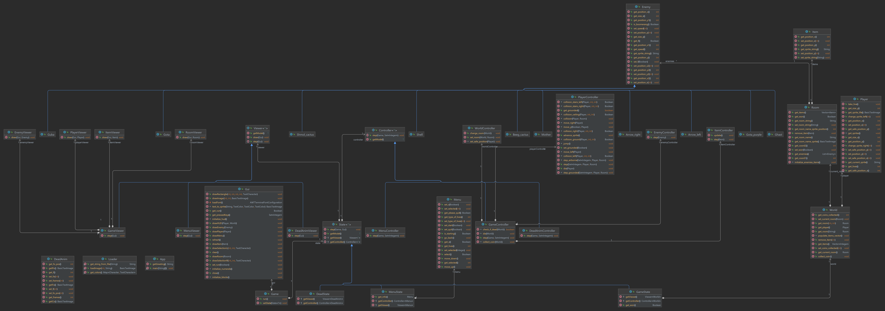
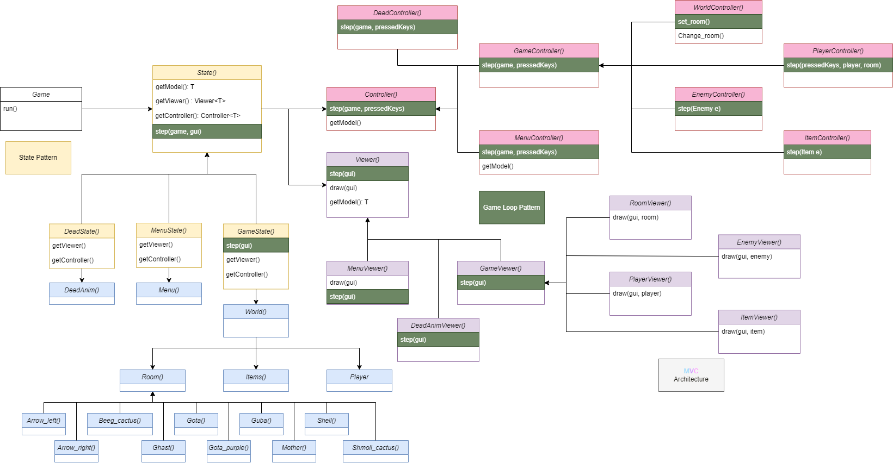
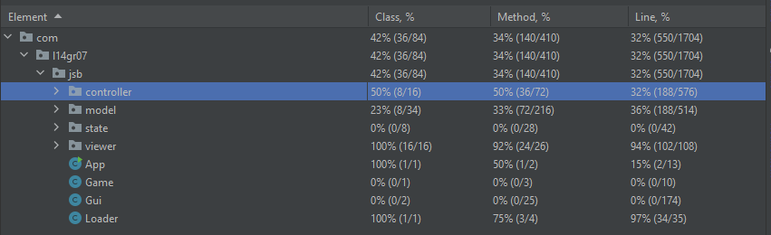

# LDTS_1407 - jet-set-willy

A kinda faithful recreation of the cult classic game for the ZX Spectrum, Jet Set Willy.
Jet Set Willy is a platform game where a tired Billy has to collect all the amulets spread out throughout multiple rooms.
These rooms are constantly filled with enemies, and Billy must avoid these in order to complete his objective of collecting
said amulets and be able to finally go have a good night sleep in his comfy bed.

-This project was made by Pedro Beirão(up202108718), João Dias da Silva(202108713) and Maria Sofia Minnemann(202007342) for LDTS 2021-22.

## IMPLEMENTED FEATURES

- **Lives Menu** - The user has the option to play with either 10 lives, or in endless mode.
- **Jumping** - The player is able to jump up, or in the direction he was walking before by pressing the space bar, experiencing a bit of acceleration during said jump.
- **Collision detection** - Collisions between different objects, like the player, walls and mosnters.
- **Multiple Stationary enemies** - Stationary enemies and objects are spread out through the house to challenge the player, killing the player if they come in contact.
- **Multiple Moving enemies** - Moving enemies provide a bigger challenge for the player, having to jump but account for the movement of the enemy itself.
- **Toilet** - Just like the original game, in the starting room a toilet, which is constantly opening and closing, can be found in the starting room.
- **Multiple Rooms** - In order to provide a better experience, multiple rooms are available for the player to traverse through during his adventure.
- **Mother** - Just like the original game, in the Bedroom, Billy's mother is there, only allowing him to go to bed when he collects all the coins.
- **Stairs** - Stairs can either allow the player to go upward, onto a higher room or platform or to jump through them and proceed onwards.
- **Ladders** - Ladders give you the ability to go upwards onto platforms too far for your reach without them.
- **Coins** - 100 coins scattered across the rooms that the player has to catch in order to go to bed.
- **Animations** - An animation is incorporated when Billy dies.

## PLANNED FEATURES

All the planned feautures, except music, where implemented. 

## DESIGN

  <b><i>Fig 1. classes UML with relations (1 to 1, 1 to many) </i></b>

  <b><i>Fig 1. classes UML with usages relations </i></b>

  <b><i>Fig 3. UML </i></b>

### Problem in Context:
 While developing the game, we noticed that some classes had many different methods, resulting in a visually unappealing code. It was also hard to change some features without affecting other part of the code.
 
### The Pattern:
 We have applied the **_MVC design pattern_**. This pattern is used to divide the app in three parts:
  - **Model**: contains the data;
  - **View**: displays the model. it can access the data in it but cannot change it;
  - **Control**: exists between the model and the view. It provides data for the model to give the view and interprets actions made by the user;

  This pattern allowed to address the identified problem.It helped break up the frontend and backend code into separate components. This way, it is much easier to manage and make changes/add features.

### Implementation:
 Regarding the implementation, we have main Classes that store the data(model), classes that control the logic of the game(controllers) and classes that control the visuals on the screen(viwers). The classes are present in the UML in Fig 3.

### Consequences:
 Using this architecture has the following benefits:
  - One person can develop View while other is making changes on other components, making the development faster;
  - It is possible to provide multiple views (for example the game and the menu);
  - It is easier to add or change features
  
  On the other hand:
  - Using the MVC architecture patterns adds complexity to the code;

### The Pattern:
 We have also applied the **_State Pattern_**. This pattern allows an object to alter its behavior when there are changes in its internal state.

### Implementation:
We have implemented different states, for the game and the menu, that allow for the game to change its ehavior in an efficient way. The classes are present in the UML in Fig 3.

### Consequences:
The use og the State pattern allowed the following bennefits: 
- The several states that repesent the menu become explicit in the code, instead of relying in a series of flags.
- We don't need to have a long set of conditional if or switch states.
- The code is better organnized.
- It was easy to add new features during the development.

### The Pattern:
To continuously  run the game, we used the **_Game Loop_** pattern. Each turn of the loop, it processes user input without blocking, updates the game state, and renders the game.

### Implementation:
We have implemented a loop that runs continuously during gameplay.The classes are present in the UML in Fig 3.

### Consequences
- allows to decouple the progression of game time from user input and processor speed.

## Refactoring done
The following refactorings where done:
- We refactored the code to follow the rules of the mvc pattern;
- We did another refactor for the use of templates in state, viewer and controllers.
-We refactored many methods with the extract method (ex: collisions).
-We refactored the controller classes using the extract class refactor.

## Known Code Smells

### **Large Class**
Some classes (ex: Gui, PlayerController) contain many methods. In both of these  cases, we find it justifiable to maintain them once these classes require the methods. They both need to store a large amount of code but it wouldn't make to divide them(with extract method)

### **Switch cases and Long method**
In the Gui class, there are a many if statements in one method. However, this is necessary to separate the different types of blocks, and doesn't justify splitting them from the method, or even to another class.

### **Data class**
All the model classes are data classes. They only cointain fields with no behavior.
However, this happens because of the design pattern.

### **Lazy Class**
All enemies classes are lazy classes.

### **Message Chains**
Because of the MVC pattern, to access a model's parameter, it's necessary to make a request to its controller.

## TESTING
### Screnshot of coverage report:

  

  <b><i>Fig 6. Code coverage screenshot</i></b>

### Link to mutation testing report
[Mutation tests](../app/build/reports/pitest/202212232356/index.html)

